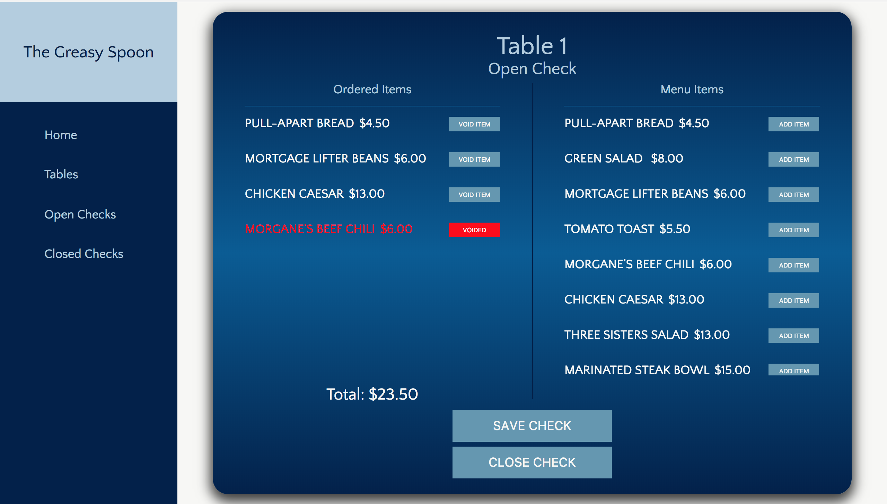

###The Greasy Spoon

Live App
https://the-greasy-spoon-hs-1-29-2018.herokuapp.com/

###To run locally:

Clone this repository to an empty directory.

Run npm install

Run npm run build

Run npm start

Create a .env folder where you'll store your API key to use the backend.
Save the key to variable REACT_APP_API_KEY

Thats it!

The Greasy Spoon is a point of sale system that allows a user, (server), to create
checks against the restaurants tables.  User can open checks, add items to open checks, void items when needed,
and close checks out.  This application was created with React.js, Redux, Router, and a static Express.js server file.

